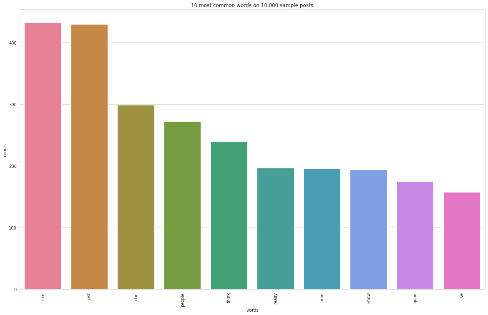

# Topic-Modeling
CSCE5214 Project 3

See [chdoig pytexas 2015](https://github.com/chdoig/pytexas2015-topic-modeling) for some good images for slide. 

[Project Slided](https://docs.google.com/presentation/d/1ERowUiQGl1vcdxdkJvggwoQTMK2b4Gydfo8AUgfXwBA/edit#slide=id.p)

[Project Proposal](https://docs.google.com/document/d/1IurVytwQQfzHEKRggLSTXKWmXXx2LFkrBNVKZ_a2GtI/edit#heading=h.c5fey97qfjje)

[Call an Amazon SageMaker model endpoint using Amazon API Gateway and AWS Lambda](https://aws.amazon.com/blogs/machine-learning/call-an-amazon-sagemaker-model-endpoint-using-amazon-api-gateway-and-aws-lambda/)

