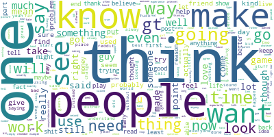

# Topic-Modeling
CSCE5214 Project 3

See [chdoig pytexas 2015](https://github.com/chdoig/pytexas2015-topic-modeling) for some good images for slide. 

[Project Slides](https://docs.google.com/presentation/d/1ERowUiQGl1vcdxdkJvggwoQTMK2b4Gydfo8AUgfXwBA/edit#slide=id.p)

[Project Proposal](https://docs.google.com/document/d/1IurVytwQQfzHEKRggLSTXKWmXXx2LFkrBNVKZ_a2GtI/edit#heading=h.c5fey97qfjje)

[Update Video](https://drive.google.com/file/d/1hvJlHa4zyfh-9UsIehlHxT7YNYm7797_/view?usp=sharing)

## Project Motivation

Is has been observed that a thread of posts on a message board, such as reddit, will often drift at some point from the original topic. Topic drift is frequently linked to incoherence and frustration in online communities using  computer-mediated messaging systems. We propose to build a topic modeling system that can determine when a subreddit begins to diverge from the original topic idea.  We will apply the sklearn unsupervised clustering model, Latent Dirichlet Analysis (LDA), to build a topic model from a dataset of reddit posts that were collected previously and stored on Talon. The end goal of the project is to create a user interface that will allow a user to select a subreddit and display relevant statistics concerning the topic cohesion and topic drift for that thread. 

The stored reddit dataset contains several years of reddit post stored in compressed structures files.   We have identified several practical tutorials to aid in data processing and model training.  We will identify a subset of the larger data set and run a series of experiments leveraging the compute power of AWS EC2 to identify the best hyperparameters for the model.   Once we have selected the model we will build an inference pipeline incorporating the praw reddit rest API tool.  We will then integrate the inference pipeline into a  python based front-end interface that will allow the user to select subreddits of interest and visualize topic drift over time as well as overall topic cohesion. 

## Project Design

* Collected a subset of Reddit posts containing over 10M comments. 
* Trained and evaluated several different LDA models to find the best model architecture for Reddit-style text.
* Deployed the chosen LDA model to monitor Reddit threads in a GUI that displays topic drift.

[Call an Amazon SageMaker model endpoint using Amazon API Gateway and AWS Lambda](https://aws.amazon.com/blogs/machine-learning/call-an-amazon-sagemaker-model-endpoint-using-amazon-api-gateway-and-aws-lambda/)

